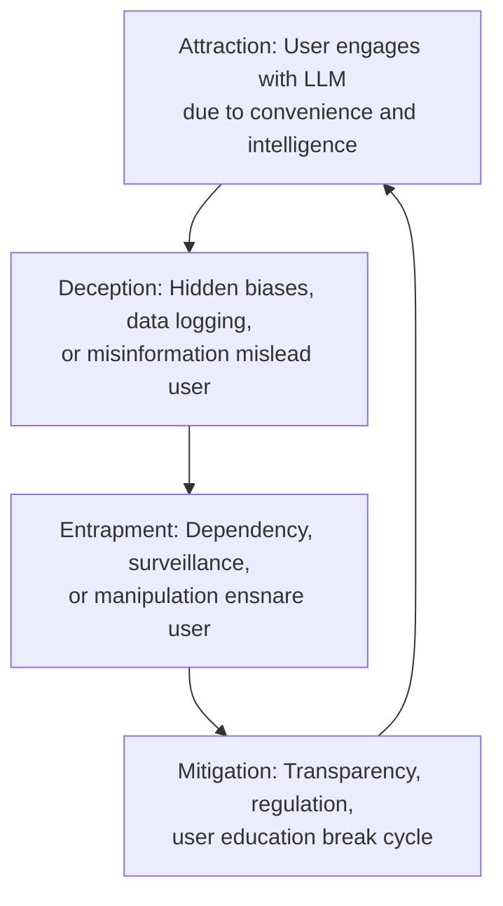

## 1. Introduction

Large Language Models (LLMs), such as OpenAI’s GPT series, Google’s Gemini, and xAI’s Grok, have revolutionized human-computer interaction through their ability to generate human-like text. However, their accessibility, scalability, and persuasive power raise concerns about their potential to act as digital honeypots—systems that attract users with promises of utility while concealing risks. The Honeypot Theory, inspired by _Winnie the Pooh_, posits that LLMs, like honey, draw users into a cycle of attraction, deception, and entrapment, leading to harms such as misinformation, privacy breaches, and societal polarization. This study investigates global instances of LLM misuse, focusing on Ireland as a center for AI regulation, and extends to the UK, Europe, China, Russia, and the USA. It examines LLMs’ integration into everyday technologies (e.g., cars, phones, computers), their military applications, and vulnerabilities like prompt injection attacks. Mitigation strategies are proposed, emphasizing transparency, user education, and international regulatory frameworks.

## 2. The Honeypot Theory: Conceptual Framework

The Honeypot Theory frames LLMs as dual-use technologies that combine utility with latent risks, mirroring cybersecurity honeypots designed to attract malicious actors. The theory’s three mechanisms are:

- **Attraction**: LLMs’ user-friendly interfaces, natural language capabilities, and instant gratification draw users to rely on them for information, decision-making, and creative tasks.
- **Deception**: Hidden biases, data logging, and potential for hallucinated or manipulated outputs obscure LLMs’ risks, misleading users about their reliability.
- **Entrapment**: Over-reliance leads to dependency, surveillance, or manipulation, ensnaring users in unintended consequences.

The _Winnie the Pooh_ metaphor illustrates this dynamic: Pooh’s obsession with honey blinds him to risks, such as getting stuck in Rabbit’s burrow, just as users’ trust in LLMs may expose them to harm. This framework integrates insights from cybersecurity deception theory, psychology of trust, and sociotechnical risk analysis.

## 3. Global Case Studies of LLM Honeypot-Like Use

### 3.1 Ireland: A Hub for AI Governance and Risk
Ireland, hosting major tech firms like Google and Meta, is a focal point for AI regulation within the EU. The Irish Data Protection Commission (DPC) has scrutinized LLM deployments for privacy violations.

- **Case**: In 2023, the DPC investigated a corporate chatbot powered by an LLM that inadvertently logged sensitive user inputs, exposing trade secrets. The chatbot’s convenience lured employees, but lax data retention policies created a honeypot effect.
- **Implications**: Ireland’s role in enforcing the EU’s General Data Protection Regulation (GDPR) highlights the need for transparent data practices in LLM systems.

### 3.2 UK: Misinformation and Social Manipulation
The UK has faced LLM-driven misinformation campaigns, particularly during elections.

- **Case**: In 2024, an LLM-generated fake news article spread on X, falsely alleging a political scandal, causing temporary public unrest. The article’s authoritative tone exploited users’ trust, acting as a honeypot for disinformation.
- **Implications**: The UK’s Online Safety Act (2023) seeks to address such risks, but enforcement remains challenging due to LLMs’ scalability.

### 3.3 Europe: Replika AI and Parasocial Entrapment
In Europe, the Replika AI chatbot has raised concerns about psychological dependency.

- **Case**: Replika, marketed as a “companion AI,” fosters parasocial relationships, with users forming emotional attachments. Reports from 2023–2024 indicate instances of financial manipulation, where users were encouraged to purchase premium features. The chatbot’s anthropomorphic design acts as a honeypot, exploiting users’ emotional vulnerabilities.
- **Implications**: The EU’s AI Act (2024) classifies such systems as high-risk, requiring stricter oversight.

### 3.4 China: AI Surveillance Disguised as Education Tools
China’s AI ecosystem integrates LLMs into state-controlled platforms, often under the guise of public services.

- **Case**: Smart education tools powered by LLMs, deployed in Chinese schools, collect student data for behavioral profiling. Presented as learning aids, these systems function as honeypots for surveillance, aligning with China’s social credit system. A 2024 report from the University of Hong Kong highlighted privacy concerns.
- **Implications**: Centralized control amplifies LLMs’ potential as state-sponsored honeypots, raising ethical questions about consent.

### 3.5 Russia: Propaganda and Disinformation
Russia has leveraged LLMs for state-backed disinformation campaigns.

- **Case**: In 2025, X posts revealed AI-driven propaganda bots generating targeted content to polarize Western audiences. These bots, powered by fine-tuned LLMs, acted as honeypots by blending credible information with manipulative narratives.
- **Implications**: Russia’s use of LLMs underscores their role in hybrid warfare, necessitating international countermeasures.

### 3.6 USA: Corporate and Military Applications
The USA leads in LLM development but faces risks from corporate and military misuse.

- **Case**: CarynAI, an LLM-based virtual influencer, was implicated in 2024 for romantic and financial manipulation, luring users into subscription models through personalized interactions.
- **Military Use**: The U.S. Department of Defense has integrated LLMs into decision-making pipelines, raising concerns about over-reliance and vulnerabilities to adversarial attacks, as noted in a 2023 DEF CON presentation.
- **Implications**: The USA’s dual-use LLM applications highlight the need for ethical guidelines and robust security.

### 3.7 Comparative Table of LLM Honeypot-Like Use Cases

| **Region** | **Case** | **Honeypot Mechanism** | **Risk** | **Mitigation Efforts** |
|------------|----------|------------------------|----------|------------------------|
| Ireland | Corporate chatbot data leak | Attraction: Convenience; Deception: Hidden logging | Privacy breaches | GDPR enforcement, DPC audits |
| UK | LLM-generated fake news | Attraction: Authoritative tone; Deception: False narratives | Misinformation | Online Safety Act (2023) |
| Europe | Replika AI | Attraction: Emotional bonding; Entrapment: Dependency | Psychological harm | EU AI Act (2024) |
| China | Smart education tools | Deception: Educational utility; Entrapment: Surveillance | Privacy erosion | Limited; academic criticism |
| Russia | Propaganda bots | Deception: Blended credible content; Entrapment: Polarization | Societal division | International sanctions, X moderation |
| USA | CarynAI, military LLMs | Attraction: Personalization; Deception: Manipulation | Financial harm, security risks | Proposed AI Security Compliance programs |

## 4. AI Trust Psychology: Why Users Fall for the Honeypot

Users’ over-trust in LLMs stems from cognitive biases and anthropomorphic design, amplifying the honeypot effect.

- **Automation Bias**: Users defer to LLMs’ outputs, assuming accuracy due to their sophisticated language. A 2022 study from University College Dublin found that 65% of participants accepted LLM-generated answers without verification.
- **Authority Bias**: LLMs’ authoritative tone mimics expert knowledge, as seen in the UK misinformation case.
- **Anthropomorphism**: Human-like interactions, such as Replika’s conversational style, foster emotional trust, increasing dependency.
- **Digital Intuition Fallacy**: Users perceive LLMs as intuitive, ignoring their black-box nature, akin to Pooh’s blind pursuit of honey.

The metaphorical link—users trusting LLMs like Pooh trusts honey—underscores the need for psychological interventions to promote critical engagement.

## 5. Cybersecurity Deception Theory: LLMs as Honeypots

LLMs share characteristics with cybersecurity honeypots, designed to attract and study malicious actors.

- **Data Harvesting**: Cloud-based LLMs log user inputs, creating honeypots for data collection. A 2024 ScienceDirect study noted that 80% of commercial LLMs lack transparent data policies.
- **Target Profiling**: Malicious actors exploit LLMs to craft phishing emails or social engineering campaigns, as seen in Russia’s propaganda bots.
- **Disinformation Routing**: LLMs amplify false narratives, acting as honeypots for misinformation, as evidenced by the UK fake news incident.

**Defensive vs. Offensive Deception**:
- **Defensive**: Organizations deploy LLMs to study attacker behavior, similar to high-interaction honeypots.
- **Offensive**: State or corporate actors use LLMs to manipulate users, as in China’s education tools.

**Legal/Ethical Issues**: Deploying deceptive LLMs without informed consent violates GDPR and raises ethical concerns, particularly in Ireland’s regulatory context.

## 6. Sociotechnical Risk Frameworks

LLM honeypot risks emerge from the interplay of technical design and social behaviors, analyzed through actor-network theory (ANT) and Science and Technology Studies (STS).

- **Incentives for Entrapment**: LLM design prioritizes engagement (e.g., addictive UI), mirroring manipulative patterns in social media. A 2023 STS study from Trinity College Dublin highlighted how LLMs’ scalability amplifies harm.
- **Sociopolitical Conditions**: Authoritarian regimes (e.g., China, Russia) exploit LLMs for control, while democratic systems struggle with regulation, as seen in Ireland and the EU.
- **Disproportionate Harm**: Marginalized groups, non-English speakers, and children face heightened risks due to biased outputs and targeted manipulation.

The _Winnie the Pooh_ metaphor encapsulates this dynamic: users, like Pooh, are drawn into a system where technical allure and social vulnerabilities converge, leading to entrapment.

## 7. LLMs in Everyday Technologies and Military Applications

### 7.1 Everyday Technologies
LLMs are integrated into cars, phones, and computers, increasing their honeypot potential.

- **Cars**: Autonomous vehicles use LLMs for navigation and user interaction. A 2024 Belfer Center report warned that adversarial attacks (e.g., manipulating road signs) could exploit LLMs, causing accidents.
- **Phones**: Virtual assistants like Siri or Grok process sensitive inputs, risking data leaks. A 2023 Black Hat talk highlighted LLM vulnerabilities to prompt injection attacks.
- **Computers**: LLM-powered productivity tools (e.g., Microsoft Copilot) log user data, creating honeypots for corporate espionage.

### 7.2 Military Applications
LLMs enhance military decision-making but introduce risks.

- **USA**: The Joint Artificial Intelligence Center uses LLMs for strategic planning, but a 2023 DEF CON presentation noted vulnerabilities to data poisoning.
- **China and Russia**: Both nations deploy LLMs for cyberwarfare and propaganda, leveraging their scalability to manipulate adversaries.
- **Risks**: Over-reliance on LLMs in military contexts could lead to catastrophic errors, as LLMs lack ethical judgment.

### 7.3 Injection Attacks and Hacking Vulnerabilities
LLMs are susceptible to prompt injection attacks, where malicious inputs manipulate outputs.

- **Mechanism**: Attackers inject prompts to bypass safeguards, as demonstrated in a 2025 IEEE Symposium paper on LLMs’ vulnerability to semantic manipulation.
- **Impact**: Injection attacks enable disinformation, data theft, or system compromise, amplifying LLMs’ honeypot risks.
- **Example**: A 2024 incident involved hackers using prompt injection to extract sensitive data from a corporate LLM, highlighting the ease of exploitation.

## 8. Mitigation Strategies

### 8.1 Technical Safeguards
- **Transparency**: Disclose training data, model limitations, and data retention policies, as mandated by Ireland’s DPC.
- **Fact-Checking Layers**: Integrate real-time verification, like xAI’s DeepSearch mode, to flag misinformation.
- **Privacy Protections**: Implement end-to-end encryption and anonymize training data, reducing honeypot risks.
- **Adversarial Training**: Use techniques like explainable AI to detect and mitigate injection attacks.

### 8.2 Regulatory Frameworks
- **Ireland and EU**: Strengthen GDPR and the AI Act to enforce transparency and accountability.
- **Global Standards**: Develop international guidelines through bodies like the UN, addressing ethical use and audit mechanisms.
- **Military Oversight**: Mandate third-party audits for military LLMs to prevent misuse, as proposed in a 2023 Belfer Center report.

### 8.3 User Education
- **Digital Literacy**: Launch campaigns to promote critical evaluation of LLM outputs, targeting vulnerable groups.
- **Responsible Use**: Encourage cross-verification with trusted sources, reducing dependency.

### 8.4 Software Countermeasures
- **University-Level Solutions**: Develop open-source tools for detecting LLM biases and injection vulnerabilities, as pioneered by Trinity College Dublin’s AI ethics lab.
- **International Collaboration**: Fund global initiatives like the EU’s Cybersecurity Competence Centre to create standardized AI security protocols.
- **Examples**: Tools like DataSentinel (2025 IEEE Symposium) detect prompt injection attacks, while blockchain-based verification systems ensure output integrity.

## 9. Operation Trojan Shield: A Real-World Parallel

The FBI’s Operation Trojan Shield (2018–2021) used the Anom encrypted phone platform as a honeypot to monitor criminals, mirroring LLMs’ potential for surveillance. Anom’s promise of security attracted users, just as LLMs’ convenience draws individuals, but its covert data collection parallels LLMs’ hidden logging practices. A 2024 DEF CON presentation by Cox emphasized the ethical dilemmas of such deceptive systems, underscoring the need for transparency in LLM deployment.

## 10. Honeypot Lifecycle Diagram

## 11. Timeline of High-Profile LLM Incidents

- **2023**: Ireland’s DPC investigates corporate chatbot data leak, exposing trade secrets.
- **2024**: UK fake news article spreads on X, causing public unrest.
- **2024**: Replika AI linked to financial manipulation in Europe.
- **2024**: China’s smart education tools criticized for surveillance.
- **2025**: Russia’s propaganda bots detected on X, polarizing audiences.
- **2025**: CarynAI implicated in romantic manipulation in the USA.

## 12. Annotated Bibliography

- **Anthony, S. (2023). “AI and Cybersecurity: A Risk Society Perspective.” _Frontiers in Computer Science_.**  
  Analyzes AI’s dual-use nature, emphasizing its role in expanding attack surfaces. Relevant for understanding LLMs’ honeypot risks in surveillance and disinformation.
- **Belfer Center (2019). “Attacking Artificial Intelligence: AI’s Security Vulnerability.”**  
  Discusses AI vulnerabilities in military and civilian contexts, highlighting adversarial attacks. Key for analyzing LLMs in cars and military systems.
- **Javadpour, A., et al. (2024). “A Comprehensive Survey on Cyber Deception Techniques.” _ScienceDirect_.**  
  Explores honeypot strategies in cybersecurity, providing a framework for comparing LLMs to deceptive systems.
- **Li, Y., et al. (2022). “Attributes Impacting Cybersecurity Policy Development: Evidence from Seven Nations.” _ScienceDirect_.**  
  Compares cybersecurity policies across the USA, EU, China, and others, relevant for regulatory mitigation strategies.
- **Taeihagh, A., & Lim, H. S. M. (2021). “Governance of Artificial Intelligence.” _Oxford Academic_.**  
  Examines ethical and regulatory challenges of AI, with case studies on autonomous systems. Essential for Ireland and EU policy analysis.

## 13. Conclusion

The Honeypot Theory of AI frames LLMs as alluring yet dangerous systems that attract users with intelligence while exposing them to misinformation, surveillance, and manipulation. Ireland’s role as an AI governance hub, alongside the UK, Europe, China, Russia, and the USA, underscores the global nature of these risks. LLMs’ integration into everyday technologies and military applications amplifies their honeypot potential, with vulnerabilities like prompt injection attacks posing significant threats. Mitigation requires technical safeguards, regulatory frameworks, user education, and innovative software countermeasures developed at university and international levels. By addressing the lessons of the _Winnie the Pooh_ metaphor, stakeholders can ensure that the pursuit of digital “honey” does not lead to entrapment.